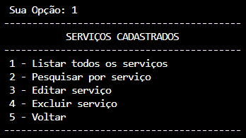

# bills1.0

Este projeto em python permite que você guarde e visualize dados de forma criptografada.

## Como executar

`
 python main.py
`

## Funcionamento

### Menu principal 

<!-- Imagem -->

### Cadastro 

> cadastrando 1 serviço
>> 

> cadastrando vários serviços
>> 

### Menu serviços 

### Lista todos serviços

### Pesquisa

> com 1 resultado
>> 

> com vários resultados
>> 

### Alterar serviço

### Excluir serviço

### Sair do Sistema

<!-- Imagem ao centro -->
<!-- 

  

  -->